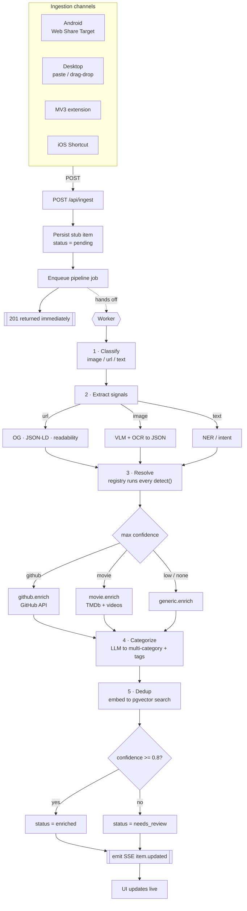
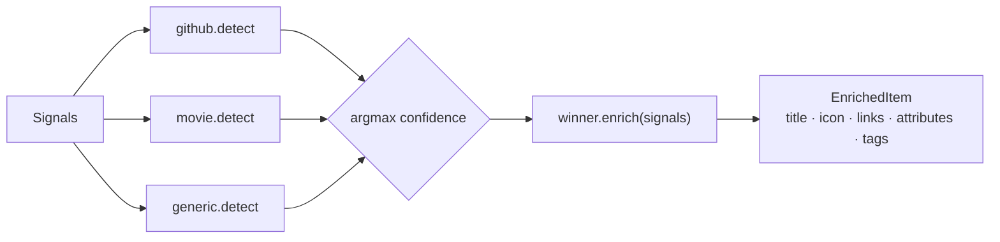

# Implementation Spec — Self-Hosted AI Capture App ("Subjects")

**Target implementer:** Fable 5 (autonomous coding agent)
**Scope of this document:** v1, **single-user**, self-hosted. Multi-user is explicitly out of scope but the schema leaves seams for it.
**Product thesis in one line:** the user shares an image, link, or text into the app; the server recognizes what it *is*, resolves it to a real entity, enriches it with typed structured data, and files it under one or more categories automatically.

---

## 0. Rules for the implementing agent

Read these first. They override any instinct to explore alternatives.

1. **Architectural decisions in Section 2 are LOCKED.** Do not substitute frameworks, datastores, or queue technology. Do not research alternatives. If a locked choice genuinely blocks you, stop and report the blocker rather than silently swapping it.
2. **Build phase by phase (Section 9).** Each phase has explicit exit criteria. Do not begin phase N+1 until phase N's exit criteria pass. At each phase boundary, produce a short status note listing which exit criteria pass.
3. **The resolver pipeline (Section 6) is the core.** Everything else is scaffolding for it. Get the plugin contract right before writing any concrete resolver.
4. **Confidence gates everything.** Entity resolution can be wrong (wrong repo, wrong movie/year). Never present a low-confidence guess as fact. Route it to a review queue. This is a correctness requirement, not a nice-to-have.
5. **Every ingestion channel is a thin client of one endpoint** (`POST /api/ingest`). Do not put recognition logic in any transport.
6. **Single-user simplifications are deliberate** (Section 8). Implement them; do not add auth/user infrastructure beyond what's specified.
7. Prefer standard, boring, well-documented libraries. Keep idle resource use low.

---

## 1. What the system does (worked examples)

These two flows are the acceptance bar for v1. If both work end-to-end, the product works.

**GitHub repo screenshot.** User shares a screenshot of a GitHub repo page → server OCRs it, detects it's GitHub, extracts the `owner/repo`, calls the GitHub API, and creates an item with: canonical repo URL, description, owner avatar as icon, star count, primary language, topics → tags, filed under categories `Development` and `Links`.

**Movie screenshot / overview.** User shares a screenshot or a text blurb about a movie → server detects it's a movie, resolves it via TMDb, and creates an item with: poster thumbnail, description, a `links` object `{trailer, imdb, homepage}`, ratings, genres → tags, filed under `Movies` (and any other matching category).

**Generic fallback.** Anything unrecognized still produces a usable item: title, description, thumbnail from Open Graph / VLM, a best-guess type, flagged lower-confidence.

---

## 2. Locked stack

| Layer | Choice | Notes |
|---|---|---|
| Frontend | React 18 + TypeScript + Vite | PWA via `vite-plugin-pwa` (Workbox). Tailwind for styling. |
| Backend | Python 3.12 + FastAPI + Uvicorn | Pydantic v2 models everywhere. |
| Async work | **Postgres-backed queue** via `procrastinate` | **No Redis.** Enrichment runs as async jobs. If `procrastinate` proves awkward, hand-roll a `jobs` table polled by a worker + `LISTEN/NOTIFY` — the contract, not the library, is what matters. |
| Realtime | Postgres `LISTEN/NOTIFY` → SSE endpoint | Pushes `item.updated` events to the UI. No websockets needed. |
| Database | PostgreSQL 16 + `pgvector` | Single datastore for items, categories, jobs, embeddings. |
| Full-text search | Meilisearch | Deferred to Phase 4. One container. |
| AI provider | Pluggable; default **Ollama** (local) | Provider abstraction so an OpenAI/Anthropic API key can swap in via config. |
| Vision + OCR model | **Qwen2.5-VL 7B** (default, via Ollama) | Document-tuned, emits clean JSON. Fallback config slot for MiniCPM-V. |
| Text model | Reuse the VLM, or a small Qwen3 | For routing/classification/tagging. |
| Embeddings | `nomic-embed-text` via Ollama → `pgvector` | For dedup + (later) semantic search. |
| Browser extension | MV3 (Chrome/Edge/Firefox) | An ingest client; minimal version in Phase 1. |
| Deployment | Docker Compose | Services: `web` (frontend build served static), `api`, `worker`, `postgres`, `meilisearch`, and assumes an external Ollama endpoint (configurable URL). |

**Why Postgres-only queue (no Redis):** single-user self-hosting favors fewer moving parts; one datastore is simpler to back up and reason about. This is a deliberate lock.

---

## 3. Repository layout

```
capture-app/
├─ docker-compose.yml
├─ .env.example
├─ api/                      # FastAPI backend
│  ├─ app/
│  │  ├─ main.py
│  │  ├─ config.py           # env-driven settings (Pydantic Settings)
│  │  ├─ db.py               # async SQLAlchemy / asyncpg
│  │  ├─ models/             # ORM + Pydantic schemas
│  │  ├─ api/
│  │  │  ├─ ingest.py        # POST /api/ingest
│  │  │  ├─ items.py         # CRUD, review actions
│  │  │  ├─ categories.py
│  │  │  └─ events.py        # GET /api/events (SSE)
│  │  ├─ pipeline/
│  │  │  ├─ classify.py      # input-type classification
│  │  │  ├─ extract.py       # OG/JSON-LD/readability + VLM/OCR
│  │  │  ├─ resolve.py       # resolver registry + routing
│  │  │  ├─ enrich.py
│  │  │  ├─ categorize.py    # taxonomy mapping (multi-category)
│  │  │  └─ dedup.py
│  │  ├─ resolvers/
│  │  │  ├─ base.py          # Resolver ABC (detector/enricher/schema)
│  │  │  ├─ registry.py
│  │  │  ├─ github.py
│  │  │  ├─ movie.py
│  │  │  └─ generic.py       # fallback
│  │  ├─ ai/
│  │  │  ├─ provider.py      # abstract; ollama.py, openai.py impls
│  │  │  ├─ vision.py        # image → {service, ocr_text, entities} JSON
│  │  │  └─ embeddings.py
│  │  └─ jobs.py             # procrastinate tasks
│  └─ pyproject.toml
├─ web/                      # React PWA
│  ├─ src/
│  │  ├─ App.tsx
│  │  ├─ pages/ (Inbox, Item, Category, Review, Settings)
│  │  ├─ sw-share-target.ts  # SW handler for POST share target
│  │  ├─ lib/api.ts, lib/sse.ts
│  ├─ vite.config.ts         # vite-plugin-pwa + manifest incl. share_target
│  └─ package.json
└─ extension/                # MV3 ingest client
   ├─ manifest.json
   └─ background.js, content.js
```

---

## 4. Data model

Postgres. JSON columns keep type-specific data flexible so resolvers add types without migrations.

```sql
-- Items are the core entity.
CREATE TABLE items (
  id             uuid PRIMARY KEY DEFAULT gen_random_uuid(),
  type           text NOT NULL,                 -- 'github'|'movie'|'article'|'generic'|...
  status         text NOT NULL DEFAULT 'pending',-- pending|enriched|needs_review|failed
  title          text,
  description     text,
  canonical_url  text,
  icon_url       text,
  thumbnail_url  text,
  attributes     jsonb NOT NULL DEFAULT '{}',    -- type-specific: {stars, rating, runtime,...}
  links          jsonb NOT NULL DEFAULT '{}',    -- {trailer, imdb, repo, homepage,...}
  source         jsonb NOT NULL DEFAULT '{}',    -- raw shared payload + channel + received_at
  resolver_id    text,
  confidence     real,                           -- 0..1
  embedding      vector(768),
  created_at     timestamptz NOT NULL DEFAULT now(),
  updated_at     timestamptz NOT NULL DEFAULT now()
  -- multi-user seam: add owner_id uuid later; v1 leaves it out.
);

CREATE TABLE tags (
  id   uuid PRIMARY KEY DEFAULT gen_random_uuid(),
  name text UNIQUE NOT NULL
);
CREATE TABLE item_tags (
  item_id uuid REFERENCES items(id) ON DELETE CASCADE,
  tag_id  uuid REFERENCES tags(id)  ON DELETE CASCADE,
  PRIMARY KEY (item_id, tag_id)
);

-- Categories form a tree; items can sit in MANY categories (multi-placement).
CREATE TABLE categories (
  id        uuid PRIMARY KEY DEFAULT gen_random_uuid(),
  name      text NOT NULL,
  parent_id uuid REFERENCES categories(id) ON DELETE SET NULL,
  UNIQUE (name, parent_id)
);
CREATE TABLE item_categories (
  item_id     uuid REFERENCES items(id)      ON DELETE CASCADE,
  category_id uuid REFERENCES categories(id) ON DELETE CASCADE,
  PRIMARY KEY (item_id, category_id)
);

-- Async jobs (if hand-rolling instead of procrastinate).
CREATE TABLE jobs (
  id        uuid PRIMARY KEY DEFAULT gen_random_uuid(),
  item_id   uuid REFERENCES items(id) ON DELETE CASCADE,
  stage     text NOT NULL,          -- classify|extract|resolve|enrich|categorize|dedup
  status    text NOT NULL DEFAULT 'queued',
  attempts  int  NOT NULL DEFAULT 0,
  error     text,
  created_at timestamptz NOT NULL DEFAULT now()
);
```

Seed taxonomy (editable by user): `Development`, `Links`, `Movies`, `Articles`, `Products`, `Recipes`, `Papers`, `Social`, `Inbox` (catch-all for unresolved).

---

## 5. Ingestion — one endpoint, many clients

**`POST /api/ingest`** — accepts either `multipart/form-data` (files + optional `title`/`text`/`url`) or `application/json` (`{url?, text?, title?}`). Auth via a static bearer token (Section 8). Behavior:

1. Persist a stub `item` with `status='pending'`, storing the raw payload in `source`.
2. Enqueue the pipeline job for that item.
3. Return `201 {id, status:'pending'}` immediately. **Do not block on enrichment.**

Channel implementations, all posting to the above:

- **Android (Web Share Target).** In the PWA manifest:
  ```json
  "share_target": {
    "action": "/share-target",
    "method": "POST",
    "enctype": "multipart/form-data",
    "params": { "title": "title", "text": "text", "url": "url",
                "files": [{ "name": "media", "accept": ["image/*"] }] }
  }
  ```
  A service worker intercepts the POST to `/share-target`, reads the `FormData`, forwards it to `/api/ingest`, then redirects the client to the new item's view. (iOS does **not** support Web Share Target for PWAs — do not attempt it there.)
- **Desktop.** In-app paste handler (clipboard image/text/URL) and drag-and-drop, both calling `/api/ingest`. Plus the MV3 extension.
- **MV3 extension.** Toolbar button + right-click menu: "Send to Subjects." Grabs current tab URL + selection; optionally captures a visible-tab screenshot. POSTs to `/api/ingest`. Stores the API base URL + token in extension options.
- **iOS.** Ship an **iOS Shortcut** recipe (Appendix A) that takes share-sheet input and does a `POST` to `/api/ingest`. No native code in v1.

---

## 6. The resolver pipeline (core)

Async, staged, driven off the job queue. Each stage updates the item and emits an SSE `item.updated` event so the UI reflects progress live.

**Stages:**

1. **Classify** input type: image / url / text (a pasted URL and a screenshot of the same page should converge downstream).
2. **Extract signals:**
   - *URL* → fetch; parse Open Graph, Twitter Cards, **oEmbed**, **schema.org JSON-LD** (`extruct`); readability/`trafilatura` for body + canonical URL.
   - *Image* → `ai/vision.py` sends the image to the VLM with a prompt that returns **strict JSON**: `{ detected_service, ocr_text, candidate_entities, visible_url }`. `detected_service` ∈ {github, imdb, youtube, twitter/x, product, recipe, generic}.
   - *Text* → lightweight entity/intent extraction via the text model.
3. **Resolve** — the **plugin registry**. Contract (`resolvers/base.py`):
   ```python
   class Resolver(ABC):
       id: str
       item_type: str
       @abstractmethod
       def detect(self, signals: Signals) -> float: ...   # 0..1 confidence
       @abstractmethod
       async def enrich(self, signals: Signals) -> EnrichedItem: ...
   ```
   The registry runs every resolver's `detect`, picks the highest confidence, and calls its `enrich`. Ties/low scores fall to `generic`.
4. **Enrich** — the winning resolver returns `EnrichedItem` (title, description, icon, thumbnail, typed `links`, type-specific `attributes`, suggested tags). Persist onto the item.
5. **Categorize** (`categorize.py`) — pass the enriched item + the **current category tree** to the text model; it returns **one or more** category placements plus flat tags. Insert into `item_categories` (many-to-many → multi-placement) and `item_tags`.
6. **Dedup** (`dedup.py`) — embed the item; cosine-search `pgvector` for near-duplicates (same repo shared as screenshot *and* link). If match above threshold, merge/link rather than duplicate.
7. **Finalize** — set `status`: `enriched` if `confidence ≥ CONFIDENCE_AUTO` (default 0.8), else `needs_review`. Emit final SSE event.

**v1 resolvers:** `generic` (Phase 2), then `github` and `movie` (Phase 3).

- `github.detect`: signals mention github.com or VLM `detected_service == 'github'` or text matches `owner/repo`. `enrich`: GitHub REST API (`/repos/{owner}/{repo}`) → description, `stargazers_count`, `language`, `owner.avatar_url` (icon), `topics` (tags), `html_url` (canonical). Categories hint: `Development`, `Links`.
- `movie.detect`: VLM `detected_service in {imdb, movie}`, or IMDb URL, or text that reads like a film blurb. `enrich`: TMDb search → details + `/videos` (trailer) + external IDs (IMDb). Fields: poster (thumbnail), overview (description), `vote_average` (rating → attributes), genres (tags), `links:{trailer, imdb, homepage}`. Category hint: `Movies`.

---

## 7. AI provider abstraction

`ai/provider.py` defines an interface with three capabilities: `vision(image, prompt) -> str`, `complete(prompt) -> str`, `embed(text) -> list[float]`. Two implementations: `ollama.py` (default, base URL from config) and `openai.py` (used if `AI_PROVIDER=openai` and a key is set). All model names come from config, never hard-coded. Vision and categorize prompts must instruct the model to return **only** valid JSON; parse defensively (strip code fences, validate against a Pydantic schema, retry once on parse failure).

---

## 8. Single-user simplifications (implement exactly this, no more)

- **No user table, no login UI.** All items belong to the implicit single owner.
- **Auth = one static bearer token** (`APP_TOKEN` in `.env`), required on every `/api/*` write and on the SSE stream. This exists so the ingest endpoint isn't wide open on the LAN — not for multi-tenancy.
- **One set of API keys** (`GITHUB_TOKEN`, `TMDB_API_KEY`, optional `OPENAI_API_KEY`) in `.env`.
- **Seams left for multi-user (do not build):** add `owner_id` to `items`/`categories`, per-user keys, and real auth later. Note them in code comments; implement nothing.

---

## 9. Phased build plan (exit criteria are the gate)

**Phase 0 — Skeleton.** Compose stack up (api, worker, postgres). Migrations create the schema + seed taxonomy. `POST /api/ingest` for a URL that only fetches OG/JSON-LD synchronously and stores an item. Minimal React app lists items and shows one.
*Exit:* paste a URL in the UI → an item appears with title, description, thumbnail.

**Phase 1 — Ingestion channels.** Convert ingest to stub-and-enqueue. Implement: Android Web Share Target (manifest + SW forwarder), desktop paste/drag-drop, minimal MV3 extension, and the iOS Shortcut (Appendix A).
*Exit:* the same item can be created from all four channels against a real deployment; each returns fast and shows a `pending` stub.

**Phase 2 — Async pipeline + generic recognition.** Job queue + worker; SSE `item.updated` stream wired to the UI. Full stage chain with only the `generic` resolver: VLM+OCR image path, OG/JSON-LD/readability URL path, text path. Confidence gating + `needs_review` state + a Review page.
*Exit:* share a random screenshot or article URL → a sensible generic item appears as `pending` then updates live to `enriched` or `needs_review` within seconds.

**Phase 3 — Typed resolvers (the two flagship flows).** Resolver registry + `detect/enrich` routing. Implement `github` and `movie` end-to-end, including their category hints.
*Exit:* the two worked examples in Section 1 both produce fully typed, enriched items with correct icon/thumbnail, `links`, and `attributes`; a deliberately ambiguous input lands in `needs_review`.

**Phase 4 — Categorization, multi-placement, dedup, search.** LLM taxonomy mapping writing multiple `item_categories`; tag suggestions; embedding dedup; Meilisearch indexing + a search box; category-tree browsing UI.
*Exit:* a GitHub repo auto-files under both `Development` and `Links`; sharing the same repo as a link and as a screenshot results in one deduped item; full-text search returns it.

**Phase 5 — Breadth + polish.** Additional resolvers (`article`, `product`, `recipe`, `paper`(arXiv/DOI), `youtube`, `social`); semantic search over embeddings; review-queue UX; empty/error states; Settings page (models, keys, taxonomy editing).
*Exit:* at least four new resolvers pass their own example inputs; settings can change the VLM model and taxonomy without a redeploy.

---

## 10. Non-goals for v1

Multi-user / sharing / collaboration. Full-page web archiving or snapshots (that's a different product). Native mobile apps beyond the iOS Shortcut. RSS ingestion. Browser-history mining. Anything requiring credentials into third-party accounts beyond the configured API keys.

---

## 11. Definition of done (v1)

All Phase 0–4 exit criteria pass, plus: the stack comes up from `docker compose up` with a filled `.env`; the two flagship flows work from a phone (Android share target) and desktop (paste/extension); low-confidence inputs are never silently mis-filed; and the README documents setup, the iOS Shortcut, and how to add a new resolver.

---

## Appendix A — iOS Shortcut recipe (document in README)

1. New Shortcut → toggle **"Show in Share Sheet"**; accept Images, URLs, Text.
2. Action: **Get Contents of URL** → `https://<host>/api/ingest`, Method `POST`, Header `Authorization: Bearer <APP_TOKEN>`.
3. Request body **Form**: add the Shortcut Input as `media` (for images) or `url`/`text` fields as appropriate.
4. Name it "Send to Subjects." It now appears in the iOS share sheet as the receive path PWAs can't provide.

## Appendix B — Prompts (production-ready; iterate on your data)

All prompts must instruct the model to emit **only** minified JSON. Parse defensively: strip ``` fences, validate against the Pydantic schema, retry **once** on parse failure with an appended "Your last reply was not valid JSON. Return only JSON." then fall back to `generic` on a second failure.

### B.1 Vision extraction — image → signals (VLM)

**System:**
> You extract structured signals from a shared image (usually a screenshot of a web page). Return ONLY minified JSON of the form:
> `{"detected_service":<enum>,"visible_url":<string|null>,"title_guess":<string|null>,"ocr_text":<string>,"candidate_entities":[{"type":<string>,"value":<string>}]}`
> `detected_service` ∈ `["github","imdb","movie","youtube","twitter","product","recipe","article","generic"]`.
> Base `detected_service` on logos, the address bar, and layout — not only on text. If you cannot tell, use `"generic"` and leave `candidate_entities` empty. Never output prose, markdown, or explanations.

**Few-shot 1 — GitHub repo page**
Image: the github.com/facebook/react repository page.
Output:
```json
{"detected_service":"github","visible_url":"github.com/facebook/react","title_guess":"facebook/react","ocr_text":"facebook/react  Public  The library for web and native user interfaces  230k stars  48k forks  JavaScript MIT license","candidate_entities":[{"type":"repo","value":"facebook/react"}]}
```

**Few-shot 2 — IMDb title page**
Image: the IMDb page for Dune: Part Two.
Output:
```json
{"detected_service":"imdb","visible_url":"imdb.com/title/tt15239678","title_guess":"Dune: Part Two","ocr_text":"Dune: Part Two  2024  PG-13  2h 46m  8.5/10  Sci-Fi Adventure  Directed by Denis Villeneuve","candidate_entities":[{"type":"movie","value":"Dune: Part Two"},{"type":"year","value":"2024"},{"type":"imdb_id","value":"tt15239678"}]}
```

**Few-shot 3 — unrecognized photo (forces the humble path)**
Image: a photo of a mountain trail with no text.
Output:
```json
{"detected_service":"generic","visible_url":null,"title_guess":null,"ocr_text":"","candidate_entities":[]}
```

### B.2 GitHub `owner/repo` disambiguation (LLM only when OCR is ambiguous)

`github.enrich` is a **direct GitHub API call** whenever `owner/repo` is unambiguous — do NOT invoke an LLM in that case. Use this prompt only when `visible_url` is missing/partial and the OCR text implies a repo.

**System:**
> Given OCR text from a screenshot, identify the single GitHub repository it refers to. Return ONLY `{"owner":<string|null>,"repo":<string|null>,"confidence":<0..1>}`. If you cannot identify a specific repo with reasonable certainty, return nulls and confidence 0.

**Few-shot**
Input: `ocr_text: "tailwindlabs/tailwindcss  A utility-first CSS framework  82k stars"`
Output: `{"owner":"tailwindlabs","repo":"tailwindcss","confidence":0.97}`

Input: `ocr_text: "a really nice CSS framework I saw on Twitter, utility classes"`
Output: `{"owner":null,"repo":null,"confidence":0}`

### B.3 Movie / TMDb disambiguation (LLM picks among search results)

Flow: extract `{title_guess, year?, ocr_text}` → call TMDb search → pass the top N results plus the extracted context to this prompt → get the chosen `tmdb_id`. This is where wrong-movie/wrong-year errors are prevented.

**System:**
> You are matching a shared item to the correct movie. You are given extracted context and a list of TMDb candidates. Return ONLY `{"tmdb_id":<int|null>,"confidence":<0..1>}`. Prefer an exact title + release-year match. If no candidate is a confident match, return `null` and a low confidence.

**Few-shot**
Input:
```json
{"context":{"title_guess":"Dune: Part Two","year":"2024"},
 "candidates":[{"id":693134,"title":"Dune: Part Two","release_year":2024},
               {"id":438631,"title":"Dune","release_year":2021}]}
```
Output: `{"tmdb_id":693134,"confidence":0.98}`

Input:
```json
{"context":{"title_guess":"Dune","year":null},
 "candidates":[{"id":438631,"title":"Dune","release_year":2021},
               {"id":841,"title":"Dune","release_year":1984}]}
```
Output: `{"tmdb_id":null,"confidence":0.4}`  ← ambiguous year → send to needs_review

### B.4 Categorization — enriched item + taxonomy → placements + tags (text LLM)

**System:**
> You file an enriched item into a category tree. You are given the item and the current tree (as JSON). Return ONLY `{"categories":[<existing names>],"tags":[<strings>]}`. Choose EVERY category that genuinely fits — an item may belong to several. Use only category names present in the provided tree. Propose tags freely (lowercase, singular). Do not invent categories.

**Few-shot 1 — GitHub repo**
Input:
```json
{"item":{"type":"github","title":"facebook/react","description":"The library for web and native user interfaces","attributes":{"stars":230000,"language":"JavaScript"}},
 "tree":["Development","Links","Movies","Articles","Products","Recipes","Papers","Social","Inbox"]}
```
Output: `{"categories":["Development","Links"],"tags":["react","javascript","ui","frontend","library"]}`

**Few-shot 2 — movie**
Input:
```json
{"item":{"type":"movie","title":"Dune: Part Two","description":"Paul Atreides unites with the Fremen...","attributes":{"rating":8.5,"genres":["Sci-Fi","Adventure"]}},
 "tree":["Development","Links","Movies","Articles","Products","Recipes","Papers","Social","Inbox"]}
```
Output: `{"categories":["Movies"],"tags":["sci-fi","adventure","denis-villeneuve","2024"]}`

---

## Appendix C — Enrichment pipeline diagram (README-ready)

Paste directly into `README.md`; GitHub renders Mermaid natively.



**Resolver registry detail** (the contract every plugin implements):


